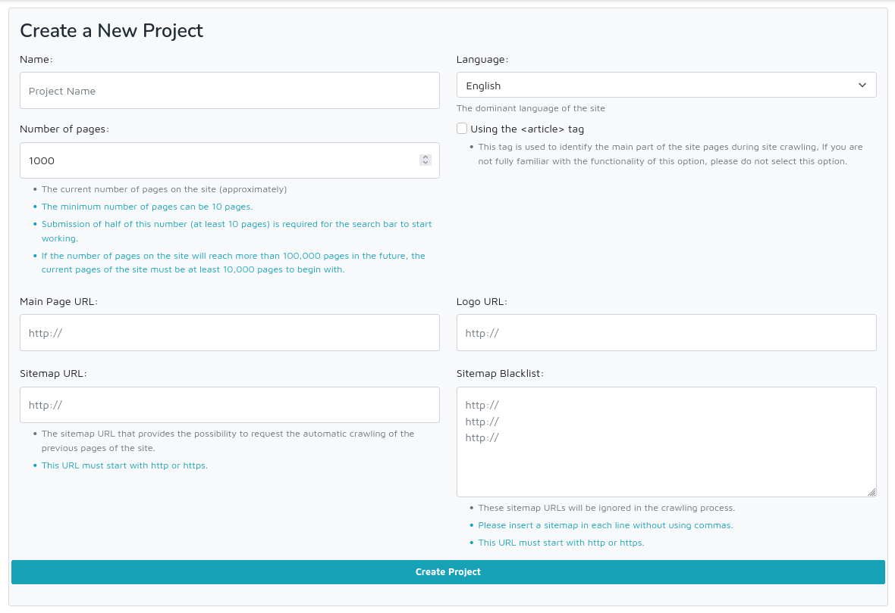

# Deepi WordPress Plugin

Let [Deepi](https://www.deepi.ir) do your site's search.

Upgrade your site's "lexical search" to "Deepi's Conceptual Search"

Take advantage of the latest "artificial intelligence" technologies

# Features

- Conceptual search service
- Conceptual search of sentences
- Conceptual search in seventy different languages
- Conceptual recommendation service
- Intelligent NER (Named Entity Recognition)
- Precise & quick

This plugin requires API keys from [Deepi](https://www.deepi.ir).

# Getting Started

A guide to setting up the WP Search with the Deepi plugin.

## Deepi Credentials

When logged into the WordPress Dashboard, find the "Deepi" entry in the left-hand admin menu and
click on it. You will be presented with the Settings page where you configure your Deepi credentials.

If you do not have a Deepi account yet, you can create one for free at [Deepi](https://www.deepi.ir).
Once you have created your account, and you have signed in,

1. Go to the [setting page](https://www.deepi.ir/dashboard/setting/).
2. Create a new project for your first website (Figure 1).

3. you will need to copy/paste the following keys to your WordPress setting form (Figure 2):

* Project Slug
* API Key

  **Note**: Copy/pasting these keys manually; is very error-prone. The copy button on the right side of each key will
  make copy/pasting easier.

  Once you have filled in the required keys on the WordPress settings form, click on the Save Changes button at the bottom of the
  form.
  
  If you have correctly provided WordPress with your Deepi keys, you will see a success message.
  
4. If your Deepi account credit is positive, the WordPress setting page status switches to "active".
  
5. Click on the "Index" button to send your content to Deepi servers. After that, everything will be kept in sync
   automatically.

## [ ] Do not use Deepi

With this option, Deepi will not replace the native WordPress search experience. Deepi will
index the content, but it will not affect the native WordPress search page experience.

This option is useful when you only need Deepi Plugin to index your WordPress content. For example, if you
intend to

* Make your content searchable from another site that implements Deepi
* Build a custom search UI with your Deepi search bar implementation

## [ ] Remove Deepi powered by logo link

This will remove the Deepi logo "link" and only displays a pure logo image.

## [ ] Remove "Deepi version" link

This will remove the "Deepi version" link at the end of each post. In this version, the named entities of
your text have been recognized quite intelligently and have become a searchable link.
